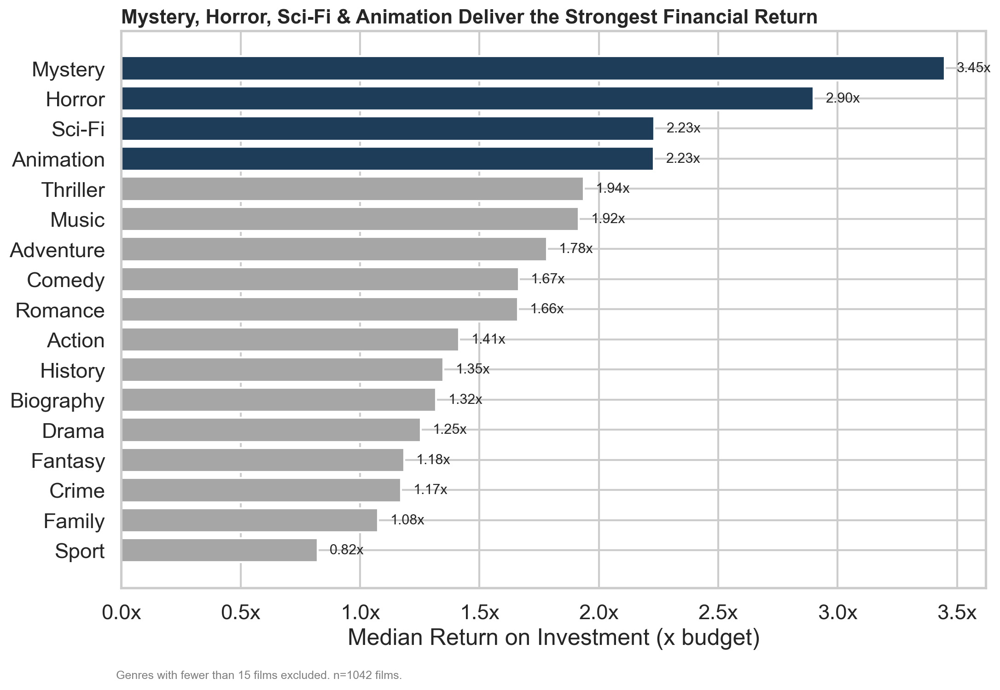
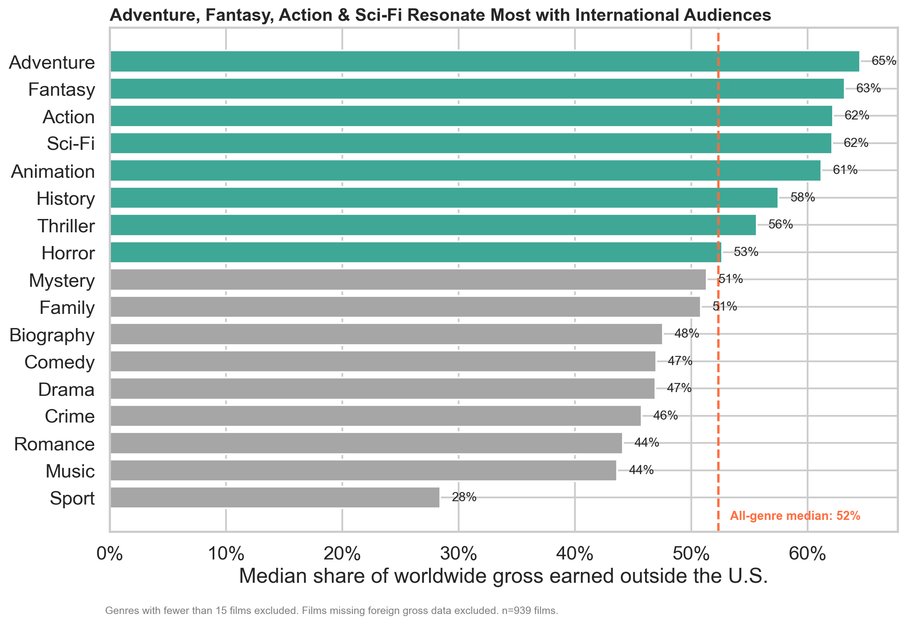
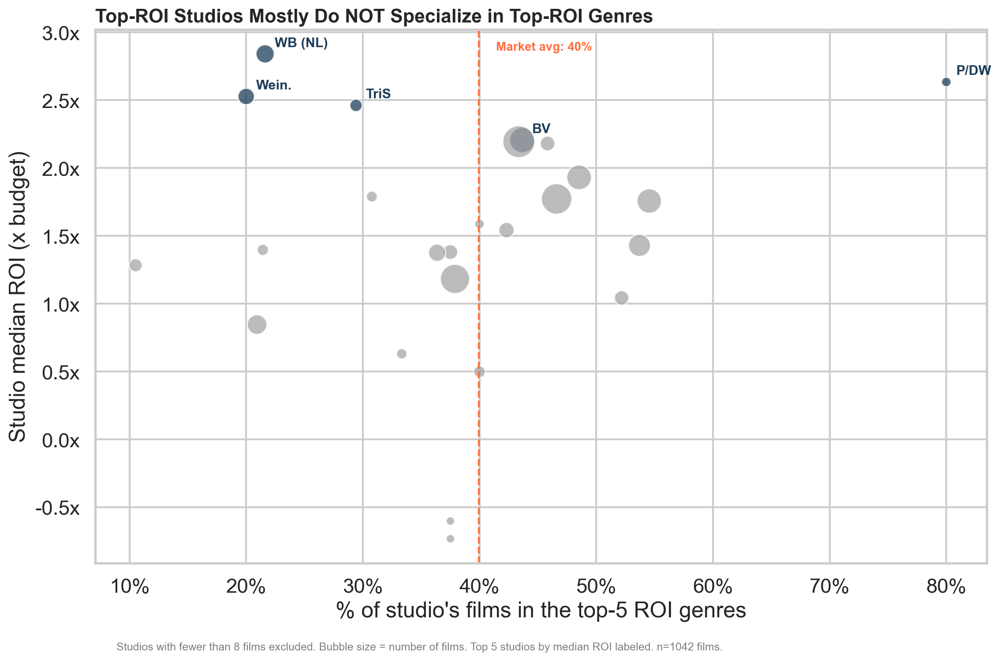

# 🎬 Movie Studio Strategy: Genre, International Reach & Studio Benchmarking

**Author:** Kevin
**Course:** Moringa School / Flatiron Data Science — Phase 2 (Module 3) Project

## Overview

This project uses exploratory data analysis on box office, budget, studio, and audience-rating data to answer three questions for a company that has just decided to launch a new movie studio:

1. **Which genres deliver the best financial return?** (measured by ROI and median profit)
2. **Which genres do best with an international audience?**
3. **Which studios perform best, and do they align with the top genres?**

Using `pandas`, financial data from **The Numbers**, studio/gross-split data from **Box Office Mojo**, and genre/rating data from **IMDB** are combined into a single analytical dataset of 1,042 major theatrical releases. The analysis yields **three data-driven recommendations**, each backed by a visualization, and packaged into a Tableau-ready dataset for further exploration.

**➡️ Start here:**
- 📊 [Non-technical presentation](presentation.pdf)
- 📓 [Full analysis notebook](index.ipynb)
- 📈 [Tableau-ready dataset](tableau/tableau_movie_dataset.csv) — see [`tableau/README.md`](tableau/README.md) for the workbook build guide

## Business Understanding

**Stakeholder:** The head of the company's new movie studio division.

**Real-world problem:** The company has no track record, no established franchises, and no in-house filmmaking expertise yet. Before committing capital to any project, studio leadership needs an evidence-based starting point for what kinds of films to greenlight — which genres pay off, which genres travel well internationally, and which existing studios are worth benchmarking against.

**Key business questions:**
1. Which genres deliver the best financial return, measured by ROI and median profit?
2. Which genres do best with an international audience?
3. Which studios perform best, and do their genre choices align with the top-performing genres?

## Data Understanding and Analysis

### Source of data

Data is provided in the `zippedData/` folder, originally sourced from:

| Source | File(s) used | What it provides |
|---|---|---|
| [The Numbers](https://www.the-numbers.com/) | `tn.movie_budgets.csv.gz` | Production budget, domestic/worldwide gross, release date |
| [Box Office Mojo](https://www.boxofficemojo.com/) | `bom.movie_gross.csv.gz` | Studio, domestic gross, foreign gross |
| [IMDB](https://www.imdb.com/) | `im.db.zip` (`movie_basics`, `movie_ratings` tables) | Genre(s), runtime, average user rating, number of votes |

The entity-relationship diagram below shows how the IMDB tables relate to each other (only `movie_basics` and `movie_ratings` are used here):


Rotten Tomatoes (`rt.movie_info.tsv.gz`, `rt.reviews.tsv.gz`) and TheMovieDB (`tmdb.movies.csv.gz`) data are included in `zippedData/` for reference but were **not used** in the final analysis, because neither shares a reliable common key with the other sources for a clean merge — see the notebook's Data Understanding section for details.

### Data cleaning

Full step-by-step cleaning is documented and executed in [`index.ipynb`](index.ipynb) (Data Preparation & Cleaning section). In summary:
- **The Numbers:** stripped `$`/`,` from currency columns and cast to `float`; parsed `release_date` into a `year`; dropped rows with a `$0` placeholder budget.
- **Box Office Mojo:** dropped 5 rows missing a `studio` label; cleaned `foreign_gross` from a comma-formatted string into a `float` (left missing values in place rather than dropping them, since they're still usable for two of the three business questions).
- **IMDB:** inner-joined `movie_basics` with `movie_ratings` on `movie_id` (which also filters out titles with too few votes to be reliably rated); dropped rows with no `genres` value.
- **Merge:** joined all three cleaned sources on matching **movie title + release year**; removed duplicate `movie_id` matches after each merge step.
- **Engineered columns:** `roi`, `profit_musd`, and `intl_share` (share of gross earned outside the U.S.).

This produced a final analytical dataset of **1,042 films** with no missing values in any column used for analysis.

### Three visualizations

**1. Genre vs. financial return**



**2. Genre vs. international audience**



**3. Studio performance vs. genre alignment**



## Conclusion

### Summary of findings and recommendations

1. **Prioritize Mystery and Horror for the strongest financial return.** Mystery (median ROI 3.45x, median profit $56.0M) and Horror (median ROI 2.90x, median profit $42.3M) are the clear financial leaders, both at modest average budgets relative to their return — a lower-risk way to build an early track record.

2. **Look to Adventure, Fantasy, Sci-Fi, and Animation for international growth.** These genres earn 60%+ of their gross outside the U.S., well above the 52% all-genre median. This is a *different* set of genres than the top-ROI list — Horror and Mystery sit right around the median internationally — so this is a distinct strategic lever (audience reach) rather than pure financial efficiency.

3. **Study execution at New Line, Weinstein, and TriStar — not just their genre mix.** The top 5 studios by median ROI are New Line/WB (2.84x), Paramount/DreamWorks Animation (2.63x), The Weinstein Company (2.53x), TriStar (2.46x), and Buena Vista/Disney (2.21x) — but only 2 of those 5 have an above-average share of films in the top-5 ROI genres. Three of the five best-performing studios succeeded largely *outside* the top genres, meaning studio success and genre choice are only loosely connected.

**Taken together:** the recommended approach is to build an early slate anchored in Mystery and Horror for reliable financial return, treat genres like Adventure and Sci-Fi as a longer-term, higher-budget bet for international reach, and benchmark operationally against New Line and Weinstein's execution rather than assuming their genre mix explains their success.

### Limitations & next steps

- This analysis is correlational, not causal. Marketing spend, release timing, star power, and franchise/IP status are confounding variables not captured here.
- `foreign_gross` was missing for about 10% of the merged dataset, slightly reducing the sample for the international-audience question.
- Rotten Tomatoes and TheMovieDB data were excluded due to a lack of a clean join key; incorporating critic scores could add a quality dimension to this analysis.
- Next step: extend this into an interactive Tableau dashboard (see `tableau/`) so studio leadership can filter by genre and studio themselves, and model release timing/marketing spend as additional levers.

## Repository navigation

```
├── README.md                    <- You are here
├── index.ipynb                  <- Full analysis notebook (Python + Markdown)
├── presentation.pdf              <- Non-technical slide deck for stakeholders
├── movie_data_erd.jpeg           <- Entity-relationship diagram for the IMDB data
├── images/                       <- Exported PNGs of the three key visualizations
├── tableau/
│   ├── tableau_movie_dataset.csv <- Cleaned, analysis-ready dataset for Tableau
│   ├── dashboard_preview.html    <- Interactive Plotly preview of the dashboard
│   └── README.md                 <- Step-by-step guide to rebuilding the dashboard in Tableau
├── zippedData/                   <- All raw source data, as originally provided
└── .gitignore
```

## Technologies used

`Python`, `pandas`, `matplotlib`, `seaborn`, `sqlite3`, Jupyter Notebook, Tableau
